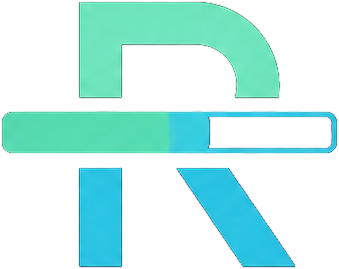

# Rspndr

Rspndr is a Figma plugin that watches progress components and updates their visual fill when their `value` component property changes.

## What it supports

### Bar
Rspndr matches `Progress / Bar` and updates:

- `Bar Master`
  - `Bar Progress`
    - `Bar Progress Indicator`

The indicator width is set to the same percentage as the `value` property, using `Bar Master` width as the source of truth.

### Radial
Rspndr matches `Progress / Radial` and updates:

- `Progress Value`

Rspndr looks for an editable ellipse inside that layer and updates its arc.

## Property rules

### `value`
Rspndr reads the `value` component property and accepts:

- `20`
- `20%`

Both are treated as `20`.

### `responsive-slider`
Rspndr requires `responsive-slider = true` for radial components.

For bar components, the plugin is configured to work without that property because the bar setup in this file does not expose it cleanly in your current Figma structure.

## How to install in Figma

1. Open Figma desktop.
2. Go to **Plugins → Development → Import plugin from manifest…**
3. Select:
   - `/Users/omni/Documents/rspndr/manifest.json`
4. Run **Rspndr**.

## How to use

1. Put a supported `Progress / Bar` or `Progress / Radial` component on the current page.
2. Keep the plugin open.
3. Change the component’s `value` property.
4. Rspndr will rescan the current page and update the visual progress layer.

## Plugin UI

The plugin UI is intentionally minimal:

- listen toggle
- tracked count
- updated count
- found charts list
- manual scan button

The Figma UI is compiled into a single self-contained `ui/index.html` file.

## Local development

### Validate files
```bash
make test
make lint
```

### Serve the standalone UI locally
```bash
make dev
```
Then open:
- `http://localhost:4173/ui/`

## Repo structure

- `manifest.json` — Figma manifest
- `plugin/code.js` — Figma runtime logic
- `ui/index.html` — compiled single-file plugin UI
- `ui/styles.css` — source styles for the UI
- `ui/app.js` — source UI logic
- `ui/respndr_logo_master.png` — UI logo
- `ui/respndr_logo_logo.png` — icon/logo asset

## Publish checklist

Before publishing:

- confirm `Progress / Bar` still uses `Bar Master / Bar Progress / Bar Progress Indicator`
- confirm `Progress / Radial` still uses `Progress Value`
- confirm `value` is the component property driving the progress state
- run:
  - `make test`
  - `make lint`
- re-import the manifest in Figma and smoke test one bar and one radial on a real page

## Current behavior notes

- The plugin watches the **current page** only.
- The plugin must remain open to listen for changes.
- Bar width is derived from `Bar Master` width.
- Radial updates require a real editable ellipse under `Progress Value`.
